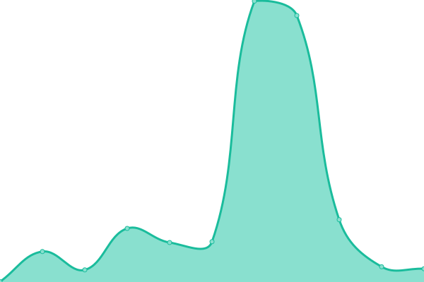
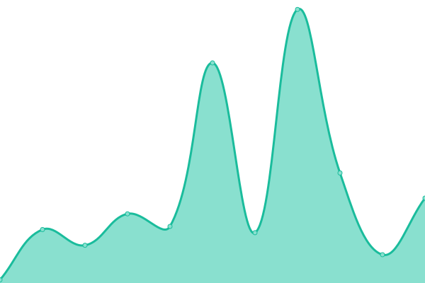
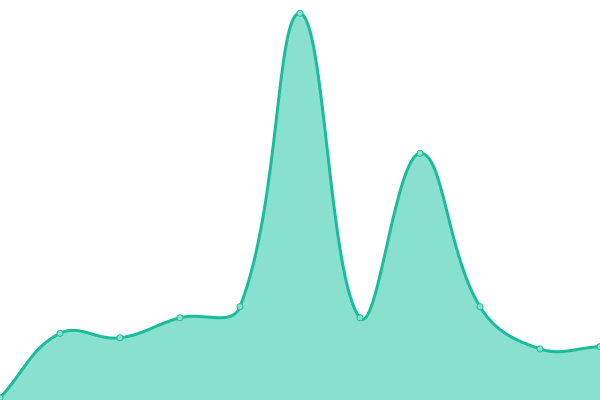

# [📈 Live Status](https://demo.upptime.js.org): <!--live status--> **🟩 All systems operational**

This repository contains the open-source uptime monitor and status page for [Upptime](https://upptime.js.org), powered by [Upptime](https://github.com/upptime/upptime).

With [Upptime](https://upptime.js.org), you can get your own unlimited and free uptime monitor and status page, powered entirely by a GitHub repository. We use [Issues](https://github.com/upptime/upptime/issues) as incident reports, [Actions](https://github.com/upptime/upptime/actions) as uptime monitors, and [Pages](https://demo.upptime.js.org) for the status page.

<!--start: status pages-->
<!-- This summary is generated by Upptime (https://github.com/upptime/upptime) -->
<!-- Do not edit this manually, your changes will be overwritten -->

| URL                                                                               | Status | History                                                                                                                                   | Response Time                                                                                       | Uptime                                                                                                                                                                                                                                                                   |
| --------------------------------------------------------------------------------- | ------ | ----------------------------------------------------------------------------------------------------------------------------------------- | --------------------------------------------------------------------------------------------------- | ------------------------------------------------------------------------------------------------------------------------------------------------------------------------------------------------------------------------------------------------------------------------ |
| [IPhysResearch](https://iphysresearch.github.io/)                                 | 🟩 Up  | [i-phys-research.yml](https://github.com/iphysresearch/status/commits/master/history/i-phys-research.yml)                                 |  211ms                |                                  |
| [IPhysResearch / Blog](https://iphysresearch.github.io/blog/)                     | 🟩 Up  | [i-phys-research-blog.yml](https://github.com/iphysresearch/status/commits/master/history/i-phys-research-blog.yml)                       |  34ms            |                        |
| [IPhysResearch / Profile](https://iphysresearch.github.io/-he.wang/)              | 🟩 Up  | [i-phys-research-profile.yml](https://github.com/iphysresearch/status/commits/master/history/i-phys-research-profile.yml)                 |  22ms         |                  |
| [IPhysResearch / Survey4GWML](https://iphysresearch.github.io/Survey4GWML/)       | 🟩 Up  | [i-phys-research-survey4-gwml.yml](https://github.com/iphysresearch/status/commits/master/history/i-phys-research-survey4-gwml.yml)       |  55ms    |        |
| [IPhysResearch / PhDthesis_html](https://iphysresearch.github.io/PhDthesis_html/) | 🟩 Up  | [i-phys-research-ph-dthesis-html.yml](https://github.com/iphysresearch/status/commits/master/history/i-phys-research-ph-dthesis-html.yml) |  25ms |  |

<!--end: status pages-->

[**Visit our status website →**](https://demo.upptime.js.org)

## 📄 License

- Code: [MIT](./LICENSE) © [Upptime](https://upptime.js.org)
- Data in the `./history` directory: [Open Database License](https://opendatacommons.org/licenses/odbl/1-0/)
