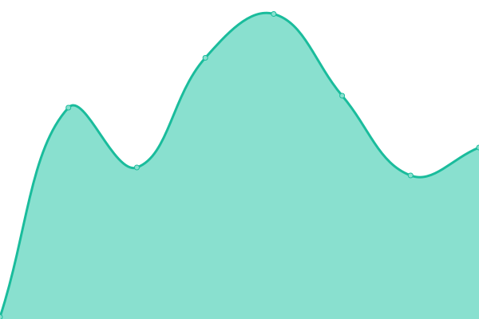
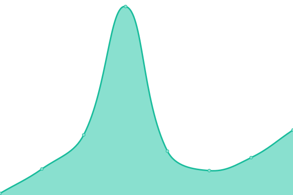
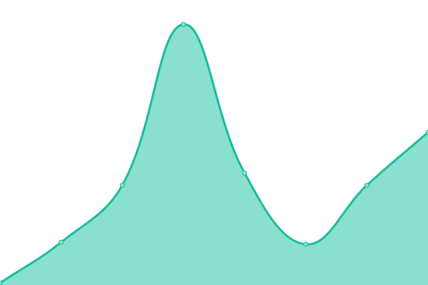
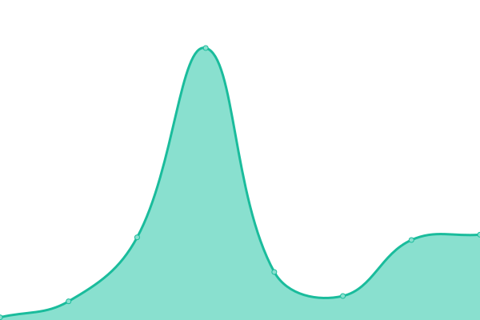

# [📈 Live Status](https://demo.upptime.js.org): <!--live status--> **🟩 All systems operational**

This repository contains the open-source uptime monitor and status page for [Upptime](https://upptime.js.org), powered by [Upptime](https://github.com/upptime/upptime).

With [Upptime](https://upptime.js.org), you can get your own unlimited and free uptime monitor and status page, powered entirely by a GitHub repository. We use [Issues](https://github.com/upptime/upptime/issues) as incident reports, [Actions](https://github.com/iphysresearch/status/actions) as uptime monitors, and [Pages](https://demo.upptime.js.org) for the status page.

<!--start: status pages-->
<!-- This summary is generated by Upptime (https://github.com/upptime/upptime) -->
<!-- Do not edit this manually, your changes will be overwritten -->
<!-- prettier-ignore -->
| URL | Status | History | Response Time | Uptime |
| --- | ------ | ------- | ------------- | ------ |
|  [IPhysResearch](https://iphysresearch.github.io/) | 🟩 Up | [i-phys-research.yml](https://github.com/iphysresearch/status/commits/HEAD/history/i-phys-research.yml) | 

 60ms
     
 | 

<a href="https://iphysresearch.github.io/status/history/i-phys-research">100.00%</a>
    

|  [IPhysResearch / Blog](https://iphysresearch.github.io/blog/) | 🟩 Up | [i-phys-research-blog.yml](https://github.com/iphysresearch/status/commits/HEAD/history/i-phys-research-blog.yml) | 

 45ms
     
 | 

<a href="https://iphysresearch.github.io/status/history/i-phys-research-blog">100.00%</a>
    

|  [IPhysResearch / Profile](https://iphysresearch.github.io/-he.wang/) | 🟩 Up | [i-phys-research-profile.yml](https://github.com/iphysresearch/status/commits/HEAD/history/i-phys-research-profile.yml) | 

 39ms
     
 | 

<a href="https://iphysresearch.github.io/status/history/i-phys-research-profile">100.00%</a>
    

|  [IPhysResearch / Survey4GWML](https://iphysresearch.github.io/Survey4GWML/) | 🟩 Up | [i-phys-research-survey4-gwml.yml](https://github.com/iphysresearch/status/commits/HEAD/history/i-phys-research-survey4-gwml.yml) | 

 35ms
     
 | 

<a href="https://iphysresearch.github.io/status/history/i-phys-research-survey4-gwml">100.00%</a>
    

|  [IPhysResearch / PhDthesis_html](https://iphysresearch.github.io/PhDthesis_html/) | 🟩 Up | [i-phys-research-ph-dthesis-html.yml](https://github.com/iphysresearch/status/commits/HEAD/history/i-phys-research-ph-dthesis-html.yml) | 

 23ms
     
 | 

<a href="https://iphysresearch.github.io/status/history/i-phys-research-ph-dthesis-html">100.00%</a>
    

<!--end: status pages-->

[**Visit our status website →**](https://demo.upptime.js.org)

## 📄 License

- Code: [MIT](./LICENSE) © [Upptime](https://upptime.js.org)
- Data in the `./history` directory: [Open Database License](https://opendatacommons.org/licenses/odbl/1-0/)
